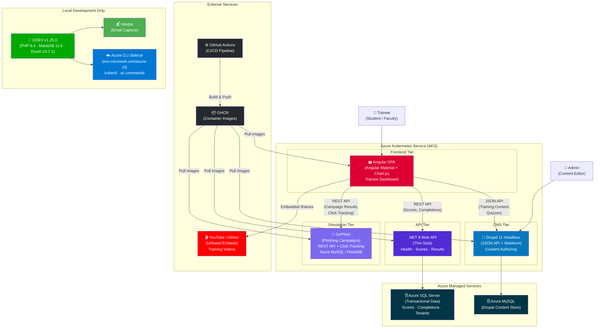

# Architecture

**[SECTION_METADATA: CONCEPTS=Decoupled_Drupal,Angular,DotNet8,AKS,Azure,GoPhish,Microservices,Security_Awareness_Training | DIFFICULTY=Intermediate-Advanced | PREREQUISITES=DDEV_Setup | RESPONDS_TO: Architectural_Decision, Implementation_How-To]**

## Project Summary

The **TSUS Security Awareness Training Platform** is a cybersecurity training and phishing simulation system built for the Texas State University System (TSUS). It serves approximately **100,000–120,000 students and faculty** across multiple TSUS member institutions.

The platform is modeled after commercial products like **KnowBe4** and **Proofpoint Security Awareness Training**. It provides:

- **Security awareness training modules** — short, focused courses covering topics like phishing, social engineering, password hygiene, and data handling.
- **Phishing simulations** — realistic simulated phishing emails sent to users, with click tracking and reporting to measure susceptibility and improvement over time.
- **Quizzes and assessments** — embedded knowledge checks tied to training content, with automatic scoring.
- **Compliance dashboards** — per-institution visibility into training completion rates, quiz scores, and simulation results so administrators can track compliance and target remediation.
- **Video-based content delivery** — embedded training videos from YouTube/Vimeo, supplemented by written modules authored in Drupal.

The goal is to give TSUS an in-house, cost-effective alternative to expensive commercial SaaS products, while maintaining full control over data, branding, and integration with existing university systems (LTI 1.3, Azure AD SSO — planned post-POC).

This repository contains the **proof-of-concept (POC)**, which demonstrates the full microservice architecture running on Azure Kubernetes Service (AKS) within a one-week timeline. The POC proves the pattern works end-to-end; post-POC, the platform scales up to production with expanded business logic, authentication, multi-tenancy, and reporting.

---

## POC Architecture (Mar 2026)

**[DIFFICULTY: Advanced] [CONCEPTS: Decoupled_Drupal, JSON_API, Angular, .NET_8, AKS, Azure, GoPhish, Phishing_Simulation] [ARCHITECTURE_DECISIONS: POC_Scope, Build_vs_Borrow, Microservice_vs_Monolith] [PERPLEXITY_INGESTION: Cost_Analysis]**

### Design Philosophy

This is a **proof-of-concept** with a < 1 week timeline. The goal is to demonstrate a working microservice architecture on AKS that can be "scaled up" — not to build every feature. We leverage free/open-source tools aggressively and defer custom development where possible.

**Pitch statement:** _"The microservice architecture is already deployed and working on Azure Kubernetes Service. We just need to scale it up."_

### Architecture Diagram



### Enterprise Tier Service Inventory

To support fine-grained cost scaling and decouple logical roles, the architecture is strictly tiered. This microservice structure prevents the monolithic scaling penalties typically associated with all-in-one CMS builds.

| Tier & Logical Role | Service Component | Deployment | Backing Store | POC Scope & Post-POC Expansion |
| :--- | :--- | :--- | :--- | :--- |
| **Frontend Hub**<br>*(Trainee UI Layer)* | **Angular SPA** | AKS (1 replica) | — | **POC:** Training module viewer, quiz UI, basic dashboard.<br>**Post-POC:** Full reporting dashboard, simulation inbox, collaboration. |
| **Business Rule Gateway**<br>*(Processing Layer)* | **.NET 8 Web API** | AKS (1 replica) | Azure SQL Server | **POC:** Thin stub handling health, result saving, and scores.<br>**Post-POC:** Core domain logic, auth, LTI 1.3, analytics. |
| **Content Repository**<br>*(Headless CMS Layer)* | **Drupal 11 Headless** | AKS (1 replica) | Azure MySQL | **POC:** Headless JSON:API serving training content, webforms.<br>**Post-POC:** Advanced workflows, content staging, tenant definitions. |
| **Specialized Tooling**<br>*(Simulation Layer)* | **GoPhish**<br>**YouTube/Vimeo** | AKS (1 replica)<br>External | Azure MySQL (gophish DB) / MariaDB (local dev)<br>— | **POC:** Basic campaign click tracking via REST API; embedded video training.<br>**Post-POC:** SMTP integration, scheduled campaigns, scalable Azure Blob Storage. |
| **Persistence Layer**<br>*(Database Tiers)* | **Azure SQL Server**<br>**Azure MySQL** | Azure Managed | — | **POC:** Basic DTU 5 for SQL, Burstable B1ms for MySQL.<br>**Post-POC:** Independent scaling based on read/write profiles (e.g. heavy SQL reads vs light MySQL writes). |
| **Infrastructure**<br>*(Hosting Layer)* | **AKS & GHCR**<br>**Azure CLI / DDEV** | Azure / GitHub<br>Local Environment | — | **POC:** Nginx ingress, sidecar pod setups, CI/CD pipeline, local Mailhog.<br>**Post-POC:** Auto-scaling node pools, WAF, Redis caching setup. |

> **Note:** Webform 6.3.x-dev is the only branch compatible with Drupal 11 (stable releases only support D10). Locked at commit `13ce2a6`.

### Repository Structure

Each microservice has its own source directory and Dockerfile. DDEV is Drupal's local development environment only — .NET and Angular are independent peers with their own build toolchains.

```
DrupalPOC/
│
├── .ddev/                    ← DDEV config (Drupal's local dev environment)
├── web/                      ← Drupal webroot (Drupal's source code)
├── composer.json             ← Drupal's PHP dependencies
├── scripts/                  ← Drupal setup scripts (idempotent)
│
├── src/
│   ├── DrupalPOC.Api/        ← .NET 8 Web API (own project, own Dockerfile)
│   └── angular/              ← Angular SPA (own project, own Dockerfile)
│
├── docker/
│   ├── api/Dockerfile        ← Multi-stage: .NET 8 SDK → ASP.NET runtime
│   ├── angular/Dockerfile    ← Multi-stage: Node 22 → Nginx serve
│   ├── drupal/Dockerfile     ← 3-stage: Composer → PHP 8.4-FPM → Nginx
│   └── gophish/Dockerfile    ← Thin wrapper on gophish/gophish:latest
│
├── k8s/                      ← Kubernetes deployment manifests (8 files)
│   ├── namespace.yaml        ← drupalpoc namespace
│   ├── secrets.yaml          ← Placeholder (real secrets via kubectl create)
│   ├── configmaps.yaml       ← Drupal nginx sidecar conf + Angular placeholder
│   ├── api-deployment.yaml   ← .NET API Deployment + Service
│   ├── drupal-deployment.yaml ← Drupal sidecar + Service
│   ├── angular-deployment.yaml ← Angular placeholder + Service
│   ├── gophish-deployment.yaml ← GoPhish + Service
│   └── ingress.yaml          ← Nginx ingress (path-based routing)
│
└── DrupalPOC.wiki/           ← Project wiki (architecture, planning, chat log)
```

| Environment | Drupal | .NET API | Angular | GoPhish |
| :--- | :--- | :--- | :--- | :--- |
| **Local dev** | `ddev start` → `http://drupalpoc.ddev.site` | `dotnet run` → `http://localhost:5000` | `ng serve` → `http://localhost:4200` | DDEV sidecar → `https://localhost:3333` |
| **AKS (production)** | K8s Service → `http://drupal-service:80` | K8s Service → `http://api-service:80` | K8s Service → `http://angular-service:80` | K8s Service → `https://gophish-service:3333` |

### Drupal Pod Architecture (PHP-FPM + Nginx Sidecar)

**[ARCHITECTURE_DECISIONS: Drupal_Pod_Architecture]**

Unlike .NET (Kestrel) or Node.js (Express), PHP does not have a built-in HTTP server suitable for production. **PHP-FPM** (FastCGI Process Manager) only speaks the FastCGI protocol on port 9000 — it cannot accept HTTP requests directly from a browser. An **Nginx reverse proxy** is architecturally required to:

1. Accept HTTP requests from clients
2. Route `.php` requests to PHP-FPM via FastCGI
3. Serve static assets (CSS, JS, images) directly without involving PHP
4. Return responses to clients

On AKS, the Drupal pod uses the **sidecar container pattern** — both containers share the same network namespace and filesystem:

```
┌──────────────────────────────────────────────────────────┐
│  Drupal Pod                                              │
│                                                          │
│  ┌──────────────────┐    ┌─────────────────────────────┐ │
│  │  nginx container  │    │  php-fpm container          │ │
│  │  (port 80)        │───▶│  (port 9000, FastCGI)       │ │
│  │                   │    │                             │ │
│  │  Serves static    │    │  Runs Drupal PHP code       │ │
│  │  files (CSS/JS)   │    │  Returns HTML/JSON to nginx  │ │
│  │  Routes *.php to  │    │                             │ │
│  │  PHP-FPM          │    │                             │ │
│  └──────────────────┘    └─────────────────────────────┘ │
│           │                        │                     │
│           └────── shared volume ───┘                     │
│                  (Drupal webroot via emptyDir)            │
└──────────────────────────────────────────────────────────┘
```

**Why sidecar (same pod), not separate Deployments:**
- **Shared filesystem** — nginx must read Drupal's static files and PHP files directly
- **Shared network** — nginx forwards to PHP-FPM on `localhost:9000`
- **Co-scaling** — they always scale 1:1; you never want 3 nginx and 1 PHP-FPM

The Kubernetes Service for Drupal targets **port 80 (nginx)**, not port 9000 (PHP-FPM). External clients never interact with PHP-FPM directly.

> **Why not Apache?** The official `drupal:11` image uses Apache + `mod_php`, where PHP runs inside the Apache process. Every Apache worker loads PHP even when serving static files. Nginx + PHP-FPM is the modern production pattern: lower memory, faster static file serving, independent scaling of the PHP worker pool. This was decided on Day 2.

### Data Flow

```
Trainee (Browser)
  → Angular SPA (AKS)
      → Drupal JSON:API (AKS → Azure MySQL)     ... training content, quizzes
      → .NET 8 API (AKS → Azure SQL)            ... scores, completions, tenant data
      → GoPhish REST API (AKS)                   ... campaign results, click tracking
      → YouTube/Vimeo (embedded iframes)         ... training videos

Admin (Browser)
  → Drupal Admin UI (AKS → Azure MySQL)         ... content authoring
```

### CI/CD Pipeline

```
Developer Push (GitHub)
  → GitHub Actions
      → Build Docker images (Angular, .NET, Drupal, GoPhish)
      → Push to GHCR (GitHub Container Registry)
      → Deploy to AKS via kubectl / Helm
```

**Pattern:** OIDC auth from GitHub Actions to Azure, GHCR for image storage, AKS for deployment.

### Azure Resources (POC) — Provisioned

All resources provisioned on **Day 1 (Mar 4, 2026)**. See **[📋 Planning](Planning)** for the full checklist.

| Resource | Name | Location | Tier | FQDN / Notes |
| :--- | :--- | :--- | :--- | :--- |
| **Resource Group** | `rg-fulleralex47-0403` | eastus2 | — | Logical container for all resources |
| **AKS Cluster** | `drupalpoc-aks` | eastus2 | Free tier (1 node, Standard_B2s) | K8s v1.33.6, 1 node Ready |
| **Azure SQL Server** | `drupalpoc-sql` | centralus | Basic / DTU 5 (~$5/mo) | `***REDACTED_SQL_HOST***` · DB: `drupalpoc` |
| **Azure MySQL** | `drupalpoc-mysql` | centralus | Burstable B1ms (~$6/mo) | `***REDACTED_MYSQL_HOST***` · DB: `drupal` |
| **Storage Account** | (existing) | eastus2 | — | AKS diagnostics |

> **Region note:** SQL and MySQL are in `centralus` because `eastus2` had capacity constraints for SQL Server provisioning during Day 1. The resource group location (`eastus2`) is a logical designation only — resources can be in any region.

### AKS Deployment Status (Day 3 — Live)

**[SECTION_METADATA: CONCEPTS=AKS,Kubernetes,Ingress,GHCR | DIFFICULTY=Intermediate | TOOLS=kubectl,DDEV,azure-cli_sidecar | RESPONDS_TO: Implementation_How-To]**

Deployed on **Mar 7, 2026** via `ddev exec -s azure-cli kubectl` commands. All manifests in `k8s/`.

| Component | Status |
| :--- | :--- |
| **Namespace** | `drupalpoc` created |
| **Secrets** | `ghcr-secret` (image pull), `api-secrets` (Azure SQL conn string), `drupal-secrets` (Azure MySQL credentials + hash salt) — all created via `kubectl create secret` |
| **ConfigMaps** | `drupal-nginx-conf` (overrides `fastcgi_pass` to `127.0.0.1:9000` for sidecar), `angular-placeholder` (HTML page) |
| **Ingress Controller** | nginx ingress controller v1.12.1 — `ingress-nginx` namespace |
| **Ingress External IP** | `20.85.112.48` |

**Pod Status:**
| Pod | Ready | Containers |
| :--- | :--- | :--- |
| angular | 1/1 | nginx:alpine (placeholder HTML) |
| api | 1/1 | ghcr.io/fullera8/drupalpoc-api (port 8080) |
| drupal | 2/2 | php-fpm + nginx sidecar (shared emptyDir volume) |
| gophish | 1/1 | ghcr.io/fullera8/drupalpoc-gophish (ports 3333, 8080) |

**Ingress Routing (path-based):**
| Path | Backend Service | Status |
| :--- | :--- | :--- |
| `/health` (Exact) | api-service:80 | ✅ Returns `{"status":"healthy"}` |
| `/api/*` (Prefix) | api-service:80 | ✅ Returns data from Azure SQL |
| `/jsonapi/*` (Prefix) | drupal-service:80 | ⚠️ 500 — Drupal needs install against Azure MySQL |
| `/` (Prefix) | angular-service:80 | ✅ Placeholder HTML page |

**Notable fix:** Azure SQL firewall blocked AKS egress IP `20.69.205.212`. Added firewall rule `AllowAKS` via `az sql server firewall-rule create`.

### POC Build vs. Borrow Strategy

**[ARCHITECTURE_DECISIONS: Build_vs_Borrow, POC_Scope]**

| Component | Strategy | Tool/Approach | Rationale |
| :--- | :--- | :--- | :--- |
| Content management | **Borrow** | Drupal 11 JSON:API (built into core) | Zero custom code for REST API |
| Quizzes/assessments | **Borrow** | Drupal Webform module (free) | Form builder with scoring, no custom quiz engine |
| Phishing simulations | **Borrow** | GoPhish (open source, Apache 2.0) | Full campaign engine with REST API, click tracking |
| Training videos | **Borrow** | YouTube/Vimeo unlisted embeds | No video infrastructure needed |
| Email testing | **Borrow** | Mailhog (built into DDEV) | Captures outbound emails locally |
| Discussion forums | **Borrow** | Drupal Forum module (in core) | Basic threaded discussions |
| Frontend UI | **Borrow** | Angular Material | Pre-built component library |
| Dashboard charts | **Borrow** | Chart.js / ngx-charts | Drop-in charting |
| Business logic API | **Build** (thin) | .NET 8 Web API | 2-3 endpoints: health, save result, get scores |
| Container images | **Build** | Dockerfiles + multi-stage | One per service |
| CI/CD pipeline | **Build** | GitHub Actions | Build → GHCR → AKS |
| AKS manifests | **Build** | Kubernetes YAML / Helm | Deployment, service, ingress per service |

### Deferred to Post-POC

See **[📋 Planning](Planning)** for the full post-POC backlog with checkboxes.

| Feature | Reason for Deferral |
| :--- | :--- |
| Azure AD / SSO | Complex integration — use Drupal built-in auth for POC |
| LTI 1.3 provider | Complex protocol — document integration point only |
| Multi-tenancy (tenant isolation) | Database schema concern — single-tenant for POC |
| Redis caching | Irrelevant at POC scale |
| Solr / Elasticsearch | Drupal core search is sufficient for demo |
| Azure Blob Storage | Use YouTube embeds + Drupal file uploads for POC |
| Full .NET business logic | Thin stub proves the pattern; expand later |
| Auto-grading engine | Webform handles basic scoring for POC |

### POC Implementation Timeline

**Full task breakdown:** See **[📋 Planning](Planning)**

| Day | Focus | Deliverable | Status |
| :--- | :--- | :--- | :--- |
| **Day 1** | Azure provisioning (AKS, SQL, MySQL) + Drupal content modeling | Infrastructure + content types | ✅ Complete |
| **Day 2** | Dockerfiles for all services + GHCR push | 3 container images in GHCR (GoPhish, Drupal FPM, Drupal Nginx) | ✅ Complete |
| **Day 3** | AKS deployment manifests + .NET thin API | 4 pods running on AKS, ingress at `20.85.112.48` | ✅ Complete |
| **Day 4** | Angular scaffold + connect to Drupal JSON:API + GoPhish | Working frontend | ✅ Complete |
| **Day 5** | Dashboard, demo data, polish, and cost-analysis structure | Pitch-ready demo + optimized documentation | ✅ Complete |

**[LLM_CONTEXT: This is the POC architecture. Days 1-5 are COMPLETE. Day 1: all Azure resources provisioned and verified, Drupal content model built (Training Module type with 6 fields, phishing quiz webform with 5 questions, 6 taxonomy categories, 3 sample nodes seeded, JSON:API + CORS configured). Day 2: 4 Dockerfiles created under `docker/` (GoPhish, .NET API, Angular, Drupal 3-stage), 3 images built and pushed to GHCR (`drupalpoc-gophish`, `drupalpoc-drupal`, `drupalpoc-drupal-nginx`). Day 3: .NET 8 API scaffolded at `src/DrupalPOC.Api/` with 3 endpoints (GET /health, POST /api/results, GET /api/scores), EF Core 8.0.24 with Azure SQL, `drupalpoc-api` image built and pushed to GHCR (4 of 5 images now). 8 K8s manifest files created in `k8s/`. All manifests applied to AKS — 4 pods running in `drupalpoc` namespace, nginx ingress controller installed, ingress external IP `20.85.112.48`. Day 4: Angular front-end connected to WebAPI and GoPhish endpoints. Day 5: Dashboard reporting populated with demo data, and full wiki restructuring explicitly tagged for AI-cost modeling against monolithic and SaaS equivalents. Post-POC, the .NET API expands to handle auth, LTI, scoring, analytics, and tenant isolation. Do not suggest adding deferred features back into the POC scope. For detailed task tracking, see [Planning](Planning).]**
