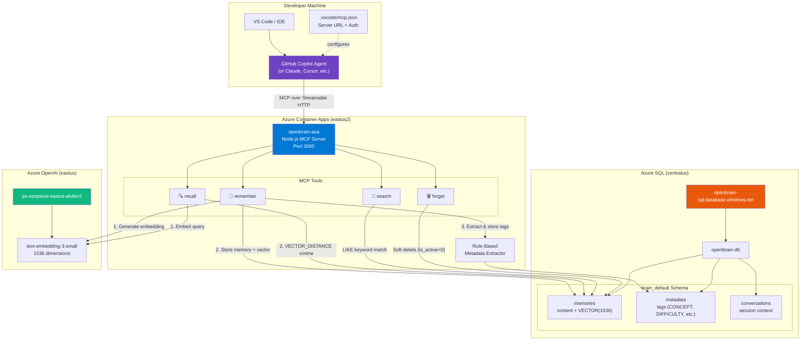

# Open Brain — LLM-Agnostic Persistent Memory Layer

**[DOCUMENT_METADATA: PURPOSE=Technical_Deep_Dive,Architecture_Overview,Connection_Guide | TARGET_AUDIENCE=Developers,LLMs,Stakeholders | CONCEPTS=MCP,Open_Brain,Azure_SQL,Azure_OpenAI,Vector_Embeddings,Copilot_Agent | RESPONDS_TO: Architectural_Decision, Implementation_How-To, Definition_Explanation | METADATA_SCHEMA_VERSION: 1.1]**

---

## Executive Summary

**Open Brain** is an LLM-agnostic persistent memory layer built as a [Model Context Protocol (MCP)](https://modelcontextprotocol.io/) server. It gives any MCP-compatible AI agent — GitHub Copilot, Claude, Cursor, or custom clients — the ability to **remember**, **recall**, **search**, and **forget** information across conversations.

Any connected agent can store a fact (e.g., _"The DrupalPOC platform uses a decoupled architecture with Angular, Drupal, and .NET"_) and later retrieve it using either **semantic vector search** (meaning-based) or **keyword search** (exact match). Memories are stored in Azure SQL with 1536-dimensional vector embeddings, enabling cosine-similarity-based retrieval.

**Key properties:**
- **LLM-agnostic** — works with any agent that speaks MCP (no vendor lock-in)
- **Persistent** — memories survive across conversations, sessions, and agent restarts
- **Schema-isolated** — multiple "brains" can coexist in one database (e.g., `brain_default`, `brain_security`)
- **Deterministic tagging** — a rule-based metadata extractor automatically tags memories with concepts, difficulty, and query-routing metadata — no LLM involved in tagging
- **Scale-to-zero** — deployed on Azure Container Apps with 0–3 replicas, paying nothing at idle

**Deployment status:** Live on Azure Container Apps at `openbrain-aca.politehill-8ea585d8.eastus2.azurecontainerapps.io`. Health endpoint returns `200 OK`. All 4 MCP tools verified end-to-end via VS Code Copilot Agent mode (Step 12: 12/12 integration tests passed — 6 local, 6 remote).

---

## Architecture

**[SECTION_METADATA: CONCEPTS=MCP,Azure_Container_Apps,Azure_SQL,Azure_OpenAI,Vector_Search | DIFFICULTY=Intermediate | RESPONDS_TO: Architectural_Decision]**

### How Open Brain Connects to Copilot Agents



### Data Flow Summary

```
Agent says: "Remember that Angular uses lazy-loaded modules for performance"
  → POST /mcp (Streamable HTTP, JSON-RPC)
    → remember tool
      → Azure OpenAI: text → 1536-dim vector embedding
      → Azure SQL: INSERT memory row + vector
      → Rule Engine: extract tags (CONCEPT:Angular, DIFFICULTY:Intermediate)
      → Azure SQL: INSERT metadata tags
    ← "Memory stored. ID: 42. Concepts: Angular. Status: tagged."

Agent says: "What do you know about Angular performance?"
  → POST /mcp
    → recall tool
      → Azure OpenAI: query → 1536-dim vector
      → Azure SQL: VECTOR_DISTANCE(cosine) k-NN search
    ← "Found 1 memory. Similarity: 0.82. Content: Angular uses lazy-loaded modules..."
```

---

## Functionality — The Four MCP Tools

**[SECTION_METADATA: CONCEPTS=MCP,remember,recall,search,forget | DIFFICULTY=Beginner | RESPONDS_TO: Definition_Explanation, Implementation_How-To]**

Open Brain exposes four tools that any MCP client can call. Each tool follows the MCP `CallToolResult` spec, returning `{ content: [{ type: "text", text: "..." }] }`.

### 🧠 `remember` — Store a Memory

Stores a piece of text with a vector embedding and automatic metadata tags.

| Parameter | Type | Default | Description |
|:--|:--|:--|:--|
| `content` | string | *(required)* | The text to remember |
| `brain` | string | `"brain_default"` | Which brain schema to store in |
| `sourceType` | enum | `"user_command"` | Origin: `user_command`, `conversation`, or `wiki_import` |
| `createdBy` | string | `"copilot_user"` | Who created the memory |

**Pipeline:** Generate embedding → Store memory + vector in SQL → Extract metadata via rule engine → Store tags → Return confirmation with memory ID, concepts found, and tag count.

### 🔍 `recall` — Semantic Vector Search

Finds memories by meaning using cosine similarity against stored vector embeddings.

| Parameter | Type | Default | Description |
|:--|:--|:--|:--|
| `query` | string | *(required)* | The question or topic to search for |
| `brain` | string | `"brain_default"` | Which brain to search |
| `topK` | number | `5` | Max results to return |
| `metadataFilter` | object | *(optional)* | Filter by `{ tagType, tagValue }` |

**How it works:** The query is embedded via Azure OpenAI, then compared against all stored memory vectors using `VECTOR_DISTANCE('cosine', ...)` in Azure SQL. Results above a 0.3 similarity threshold are returned with scores. This means the query doesn't need exact wording — _"Angular performance tips"_ will match a memory about _"lazy-loaded modules for better Angular speed"_.

### 🔎 `search` — Keyword Search

Finds memories containing an exact keyword or phrase.

| Parameter | Type | Default | Description |
|:--|:--|:--|:--|
| `keyword` | string | *(required)* | The keyword or phrase to search for |
| `brain` | string | `"brain_default"` | Which brain to search |
| `topK` | number | `10` | Max results to return |

**How it works:** Uses SQL `LIKE '%keyword%'` against memory content. Results are ordered by recency. Use this when you know the exact term (e.g., _"GoPhish"_) rather than the conceptual meaning.

### 🗑️ `forget` — Soft Delete

Removes a memory from future search results without permanently deleting it.

| Parameter | Type | Default | Description |
|:--|:--|:--|:--|
| `memoryId` | number | *(required)* | The ID of the memory to forget |
| `brain` | string | `"brain_default"` | Which brain to delete from |

**How it works:** Sets `is_active = 0` on the memory row. Content and embeddings remain in the database for audit/recovery, but the memory is excluded from all future `recall` and `search` results.

---

## Connecting to Open Brain

**[SECTION_METADATA: CONCEPTS=MCP,VS_Code,Copilot_Agent,Configuration | DIFFICULTY=Beginner | RESPONDS_TO: Implementation_How-To]**

### Option 1: VS Code with GitHub Copilot (Recommended)

> **The short version:** Clone the repo, open it in VS Code, open Copilot Chat in Agent mode, and just talk to it. Say _"Remember that our login page uses Entra ID"_ and Copilot stores it. Say _"What do you know about authentication?"_ and Copilot retrieves it. You never type commands, APIs, or JSON — you just talk.

#### How it works (conceptual)

VS Code has a feature called **MCP (Model Context Protocol)** that lets Copilot connect to external tools — like Open Brain. A config file in the repo (`.vscode/mcp.json` at the workspace root) tells VS Code: _"There is a memory server at this URL. Here's how to authenticate."_ When you open the repo in VS Code, Copilot automatically discovers Open Brain's four tools (`remember`, `recall`, `search`, `forget`) and can use them whenever your conversation calls for it.

> **Important:** VS Code only auto-discovers MCP servers from the **workspace root** `.vscode/mcp.json`. If you open `DrupalPOC/` as your workspace, VS Code reads `DrupalPOC/.vscode/mcp.json`. The duplicate at `openbrain/.vscode/mcp.json` only applies if you open the `openbrain/` directory as a standalone workspace.

**You do not need to learn any API syntax.** Copilot translates your natural language into the right tool calls behind the scenes.

#### Step-by-step setup (one-time, ~2 minutes)

**Prerequisites:**
- VS Code (latest stable) with the **GitHub Copilot** and **GitHub Copilot Chat** extensions installed
- A GitHub account with Copilot access (free tier works)

**Steps:**

1. **Clone the repo** (if you haven't already):
   ```
   git clone https://github.com/fullera8/DrupalPOC.git
   ```

2. **Open the folder in VS Code:**
   ```
   code DrupalPOC
   ```

3. **VS Code detects the MCP config automatically.** You may see a notification in the bottom-right corner saying _"MCP server discovered"_ or similar. No action needed — just let it load.

4. **Open Copilot Chat** — click the Copilot icon in the sidebar (or press `Ctrl+Shift+I`).

5. **Switch to Agent mode** — at the top of the Copilot Chat panel, click the mode dropdown and select **"Agent"** (not "Ask" or "Edit"). Agent mode is required because it allows Copilot to call external tools like Open Brain.

6. **When prompted for a token**, enter any value (e.g., `test`). Authentication is currently bypassed in dev mode. VS Code will show a password-masked input box the first time Copilot tries to connect to Open Brain.

7. **Start talking.** That's it. You're connected.

#### What to say (examples)

Once you're in Agent mode with the repo open, just type naturally:

| What you want to do | What to type in Copilot Chat |
|:--|:--|
| **Store a fact** | _"Remember that the DrupalPOC project uses DDEV for local development"_ |
| **Store a decision** | _"Remember that we chose Azure SQL over Cosmos DB because of native vector support on the Basic tier"_ |
| **Find something by meaning** | _"What do you know about our authentication strategy?"_ |
| **Find something by exact keyword** | _"Search for any memories mentioning GoPhish"_ |
| **Delete a memory** | _"Forget memory #42"_ |

Copilot will show you what tool it's calling (e.g., _"Using remember..."_) and return the result inline in the chat.

#### Which server are you connecting to?

The config file defines **two** servers. VS Code will show both:

| Server name | When to use | URL |
|:--|:--|:--|
| `openbrain-local` | You're running the Open Brain server locally (developers only) | `http://localhost:3000/mcp` |
| `openbrain-remote` | Everyone else — connects to the live Azure deployment | `https://openbrain-aca.politehill-8ea585d8.eastus2.azurecontainerapps.io/mcp` |

Most colleagues should use **`openbrain-remote`**. If VS Code asks you to pick a server, choose `openbrain-remote`.

#### FAQ

**Q: Do I need to install Node.js, Docker, or anything else?**
No. You only need VS Code + Copilot extensions. The server runs in Azure.

**Q: Do I need to understand MCP, JSON-RPC, or any protocol?**
No. Those are implementation details. You talk in English; Copilot handles the rest.

**Q: What if Copilot doesn't seem to use Open Brain?**
Make sure you're in **Agent mode** (not Ask or Edit mode). If the tools still don't appear, try reloading the VS Code window (`Ctrl+Shift+P` → _"Developer: Reload Window"_).

**Q: Can I see what memories are stored?**
Yes — ask Copilot: _"Search for all memories"_ or _"What do you remember?"_

**Q: Is my data private?**
Memories are stored in a shared Azure SQL database. Anything you store is visible to all users of the same brain (`brain_default`). Do not store passwords, personal data, or secrets.

<details>
<summary><strong>Technical detail: the config file (click to expand)</strong></summary>

The connection is defined in `.vscode/mcp.json` at the workspace root (and duplicated in `openbrain/.vscode/mcp.json` for standalone use):

```json
{
  "inputs": [
    {
      "id": "openbrain-token",
      "type": "promptString",
      "description": "Enter your bearer token for the Open Brain MCP server",
      "password": true
    }
  ],
  "servers": {
    "openbrain-local": {
      "type": "http",
      "url": "http://localhost:3000/mcp",
      "headers": {
        "Authorization": "Bearer ${input:openbrain-token}"
      }
    },
    "openbrain-remote": {
      "type": "http",
      "url": "https://openbrain-aca.politehill-8ea585d8.eastus2.azurecontainerapps.io/mcp",
      "headers": {
        "Authorization": "Bearer ${input:openbrain-token}"
      }
    }
  }
}
```

- `"type": "http"` = Streamable HTTP transport (current MCP spec)
- `${input:openbrain-token}` = VS Code prompts the user for this value at connection time
- Two server entries let you toggle between local dev and the live Azure deployment

</details>

### Option 2: Direct API (curl / HTTP Client)

Open Brain uses the **MCP Streamable HTTP** transport on a single `/mcp` endpoint. The protocol requires a session initialization handshake before tool calls.

**Step 1 — Initialize session:**
```bash
curl -s -i -X POST https://openbrain-aca.politehill-8ea585d8.eastus2.azurecontainerapps.io/mcp \
  -H 'Content-Type: application/json' \
  -H 'Accept: application/json, text/event-stream' \
  -d '{"jsonrpc":"2.0","id":1,"method":"initialize","params":{"protocolVersion":"2025-03-26","capabilities":{},"clientInfo":{"name":"my-client","version":"1.0"}}}'
```

The response includes a `Mcp-Session-Id` header — save it for subsequent requests.

**Step 2 — Send initialized notification:**
```bash
curl -s -X POST https://openbrain-aca.politehill-8ea585d8.eastus2.azurecontainerapps.io/mcp \
  -H 'Content-Type: application/json' \
  -H 'Accept: application/json, text/event-stream' \
  -H 'Mcp-Session-Id: <session-id-from-step-1>' \
  -d '{"jsonrpc":"2.0","method":"notifications/initialized"}'
```

**Step 3 — Call a tool (e.g., remember):**
```bash
curl -s -X POST https://openbrain-aca.politehill-8ea585d8.eastus2.azurecontainerapps.io/mcp \
  -H 'Content-Type: application/json' \
  -H 'Accept: application/json, text/event-stream' \
  -H 'Mcp-Session-Id: <session-id-from-step-1>' \
  -d '{"jsonrpc":"2.0","id":2,"method":"tools/call","params":{"name":"remember","arguments":{"content":"Test memory from curl","conversationId":"manual-test"}}}'
```

**Step 4 — Clean up session:**
```bash
curl -s -X DELETE https://openbrain-aca.politehill-8ea585d8.eastus2.azurecontainerapps.io/mcp \
  -H 'Mcp-Session-Id: <session-id-from-step-1>'
```

### Option 3: Health Check (No Auth Required)

```bash
curl https://openbrain-aca.politehill-8ea585d8.eastus2.azurecontainerapps.io/health
# → {"status":"ok","version":"1.0.0","brain":"openbrain"}
```

---

## Technical Deep Dive — For Developers

**[SECTION_METADATA: CONCEPTS=TypeScript,Node.js,Express,MCP,Azure_SQL,VECTOR_1536,tedious,Zod,Bicep | DIFFICULTY=Advanced | RESPONDS_TO: Implementation_How-To, Architectural_Decision]**

### Implementation Steps Summary

Open Brain was built over 11 incremental steps, each verified via compilation in the DDEV web container. See the **[💬 Chat Log](ChatLog)** (Steps 1–11) for full implementation details and debugging history.

| Step | What It Added | Key Technical Detail |
|:--|:--|:--|
| **1** | Project scaffold | 17-file structure: `package.json`, `tsconfig.json`, `.env.example`, stub files for all modules |
| **2** | Bicep infrastructure | Subscription-scoped `main.bicep` → `resources.bicep` module. Defines SQL Server, Key Vault, Container Apps, RBAC |
| **3** | SQL schema | 233-line idempotent DDL: 3 tables (`memories`, `metadata`, `conversations`), `VECTOR(1536)` column, `create_new_brain` stored proc |
| **4** | Embedding service | Azure OpenAI `text-embedding-3-small` wrapper. Lazy singleton client, batch support, 1536-dim output |
| **5** | Database service | 6 functions via `tedious`: store, tag, vector search, keyword search, soft delete, get untagged. Parameterized queries, client-side schema validation (`^[a-zA-Z0-9_]+$`) |
| **6** | Metadata extractor | Deterministic rule engine: 10 concept patterns, 5 responds-to patterns, 3 difficulty tiers. No LLM. `rules.config.json` is the single pattern config |
| **7** | Four MCP tools | `remember`, `recall`, `search`, `forget` — each exports `register(server)`. Zod input schemas. `remember` runs the full pipeline: embed → store → tag → confirm |
| **8** | MCP server entry | Express + `StreamableHTTPServerTransport`. Session-per-client architecture. CORS, Bearer auth, graceful shutdown |
| **8.5** | Pre-deploy fixes | 7 surgical corrections: 4 separate SQL env vars, no KV secret refs on first deploy, unique KV name, JWT_SECRET param, TOP limit on untagged query |
| **9** | Deploy embedding model | `text-embedding-3-small` deployed to Azure OpenAI resource (Standard SKU, capacity 1) |
| **10** | Azure infrastructure | Bicep deployed (4 attempts, 3 fixes: KV name length, SQL region, stale ARM template). 16 resources. Schema initialized via Node.js runner |
| **11** | Build, test, deploy | TypeScript compiles clean. All 4 tools pass integration tests. Docker image built and pushed to ACR. ACA updated. Remote health confirmed |
| **12** | VS Code Copilot integration testing | 12/12 end-to-end tests passed (6 local + 6 remote) via native Copilot Agent mode. 2 infrastructure fixes: workspace root `.vscode/mcp.json` for discovery, `.ddev/docker-compose.openbrain.yaml` for port 3000 mapping. No source code changes required |

### Source Tree

```
openbrain/
├── .dockerignore                         # Docker build context exclusions
├── .env.example                          # Environment variable template (not tracked in git)
├── .vscode/
│   └── mcp.json                          # VS Code MCP client config (local + remote servers)
├── Dockerfile                            # Multi-stage: node:20-slim build → production
├── package.json                          # Dependencies + build script (tsc + copy rules.config.json)
├── tsconfig.json                         # ES2022, NodeNext, strict, outDir: dist
├── test-mcp.sh                           # Integration test: full MCP protocol cycle via curl
│
├── infra/
│   ├── main.bicep                        # Subscription-scoped Bicep orchestrator
│   └── resources.bicep                   # All Azure resources (SQL, KV, ACA, RBAC, logs)
│
├── sql/
│   ├── init-schema.sql                   # Idempotent DDL: 3 tables, 4 indexes, stored proc
│   ├── run-schema.js                     # Node.js script to execute schema against Azure SQL
│   └── verify-schema.js                  # Node.js script to verify tables exist
│
└── src/server/
    ├── index.ts                          # Express + MCP Streamable HTTP entry point
    ├── metadata/
    │   ├── extractor.ts                  # Rule-based metadata extraction (no LLM)
    │   └── rules.config.json             # 10 concepts, 5 responds-to, 3 difficulty patterns
    ├── services/
    │   ├── database.ts                   # Azure SQL via tedious (6 functions, parameterized)
    │   └── embedding.ts                  # Azure OpenAI text-embedding-3-small wrapper
    └── tools/
        ├── forget.ts                     # Soft delete (is_active = 0)
        ├── recall.ts                     # Semantic vector search (cosine similarity)
        ├── remember.ts                   # Full pipeline: embed → store → tag → confirm
        └── search.ts                     # Keyword LIKE search
```

### Key Architectural Decisions

| Decision | Choice | Rationale |
|:--|:--|:--|
| **Transport protocol** | Streamable HTTP (`/mcp`) | Current MCP spec. Single endpoint for POST (JSON-RPC) + GET (SSE). Deprecated `SSEServerTransport` avoided. |
| **Session architecture** | Session-per-client (McpServer + transport per session) | SDK's `connect()` takes ownership of transport. Shared server can't serve multiple transports simultaneously. |
| **Module system** | CommonJS (NodeNext without `"type": "module"`) | Uses `__dirname` for locating `rules.config.json` relative to compiled output. `import.meta.url` is ESM-only. |
| **Metadata extraction** | Deterministic rule engine (no LLM) | Prevents hallucinated metadata from poisoning the knowledge base. All tags come from literal keyword matches. |
| **Vector storage** | Azure SQL `VECTOR(1536)` native type | GA on all tiers (including DTU Basic 5). No DiskANN index needed at <10K memory scale. |
| **Embedding format** | NVarChar JSON string → `CAST(... AS VECTOR(1536))` | Documented pattern for Azure SQL's native vector type via the tedious driver. |
| **Schema isolation** | Per-brain SQL schemas (`brain_default`, `brain_<name>`) | Complete data isolation without separate databases. `create_new_brain` stored proc clones structure. |
| **Auth (POC)** | Bearer token vs `JWT_SECRET` env var | Simple string comparison. If `JWT_SECRET` is empty, auth is bypassed (dev mode). Production: Entra ID. |
| **Container strategy** | Azure Container Apps (scale-to-zero) | 0 replicas at idle (cost = $0), scales to 3 under load. Managed identity for Key Vault access. |

### Azure Resource Map

| Resource | Name / FQDN | Location | Purpose |
|:--|:--|:--|:--|
| Resource Group | `rg-openbrain` | eastus2 | All Open Brain resources |
| Container Registry | `openbrainacr.azurecr.io` | eastus2 | Docker image storage |
| Container App | `openbrain-aca.politehill-8ea585d8.eastus2.azurecontainerapps.io` | eastus2 | MCP server runtime (0–3 replicas) |
| Container App Env | `openbrain-aca-env` | eastus2 | Shared environment for ACA |
| SQL Server | `openbrain-sql.database.windows.net` | centralus | Database host |
| SQL Database | `openbrain-db` (Basic DTU 5) | centralus | Memory storage + vectors |
| Key Vault | `kvob-7kqm2qodhvyos` | eastus2 | Secrets (post-POC migration target) |
| Azure OpenAI | `ps-azopenai-eastus-afuller2.openai.azure.com` | eastus | Embedding model host |
| Log Analytics | `openbrain-logs` | eastus2 | Container App logging |

### Environment Variables

Copy `openbrain/.env.example` to `openbrain/.env` and fill in real values:

| Variable | Purpose | Example |
|:--|:--|:--|
| `AZURE_SQL_SERVER` | SQL Server FQDN | `openbrain-sql.database.windows.net` |
| `AZURE_SQL_DATABASE` | Database name | `openbrain-db` |
| `AZURE_SQL_USER` | SQL admin username | *(stored in KeePass & Key Vault)* |
| `AZURE_SQL_PASSWORD` | SQL admin password | *(stored in KeePass & Key Vault)* |
| `AZURE_OPENAI_ENDPOINT` | OpenAI resource URL | `https://ps-azopenai-eastus-afuller2.openai.azure.com/` |
| `AZURE_OPENAI_API_KEY` | OpenAI API key | *(stored in KeePass & Key Vault)* |
| `AZURE_OPENAI_EMBEDDING_DEPLOYMENT` | Model deployment name | `text-embedding-3-small` |
| `EMBEDDING_DIMENSIONS` | Vector dimensions | `1536` |
| `SIMILARITY_THRESHOLD` | Min cosine similarity for recall | `0.7` |
| `TOP_K_RESULTS` | Default max results | `5` |
| `MCP_SERVER_PORT` | HTTP listen port | `3000` |
| `JWT_SECRET` | Bearer token for auth (empty = no auth) | *(empty for dev)* |

### Local Development

**Prerequisites:** DDEV running with the DrupalPOC project (`ddev start`). Port 3000 must be exposed to the host via `.ddev/docker-compose.openbrain.yaml`:

```yaml
services:
  web:
    ports:
      - "3000:3000"
```

If this file doesn't exist, create it and run `ddev restart`. Without it, the Open Brain server runs inside the container but is unreachable from the Windows host (and from VS Code MCP discovery).

```bash
# 1. Compile TypeScript
ddev exec bash -c "cd /var/www/html/openbrain && npx tsc"

# 2. Start the server
ddev exec bash -c "cd /var/www/html/openbrain && node dist/server/index.js"
# → Open Brain MCP server running on port 3000

# 3. Test health
curl http://localhost:3000/health
# → {"status":"ok","version":"1.0.0","brain":"openbrain"}

# 4. Run integration tests (all 4 tools)
ddev exec bash /var/www/html/openbrain/test-mcp.sh
```

### Docker Build & Deploy

```bash
# Build
cd openbrain
docker build -t openbrainacr.azurecr.io/openbrain-mcp:v1 .

# Push to ACR
docker login openbrainacr.azurecr.io
docker push openbrainacr.azurecr.io/openbrain-mcp:v1

# Update ACA
az containerapp update --name openbrain-aca --resource-group rg-openbrain \
  --image openbrainacr.azurecr.io/openbrain-mcp:v1
```

The Dockerfile uses a multi-stage build: `node:20-slim` for compilation (npm ci + tsc + copy rules.config.json), then a clean `node:20-slim` production stage (npm ci --production + copy dist). Final image exposes port 3000 and runs `node dist/server/index.js`.

---

## Related Documentation

- **[🏗️ Architecture](Architecture)** — Full DrupalPOC platform architecture (Open Brain is one component)
- **[💬 Chat Log](ChatLog)** — Implementation details for Steps 1–11 with debugging history
- **[📋 Planning](Planning)** — Task tracking and post-POC backlog (including Open Brain Phase 2 items)
- **[📖 Metadata Legend](Metadata-Legend)** — Tag vocabulary used by the metadata extractor

**[LLM_CONTEXT: Open Brain is the persistent memory MCP server in the `openbrain/` directory. It exposes 4 tools (remember, recall, search, forget) over Streamable HTTP at `/mcp`. Connect via `.vscode/mcp.json` at the workspace root (two entries: local at port 3000, remote at ACA FQDN). A duplicate exists at `openbrain/.vscode/mcp.json` for standalone workspace use. DDEV requires `.ddev/docker-compose.openbrain.yaml` to expose port 3000 to the host. Auth is Bearer token against JWT_SECRET (empty = no auth in dev). The metadata extractor is deterministic — no LLM in tagging. Vector search uses Azure SQL VECTOR(1536) with cosine similarity. The tag vocabulary (CONCEPT, RESPONDS_TO, DIFFICULTY, METADATA_STATUS) aligns with the wiki metadata schema v1.1. Step 12 verified all tools end-to-end via VS Code Copilot Agent mode (12/12 tests passed). For implementation details, see ChatLog.md Steps 1-12.]**
